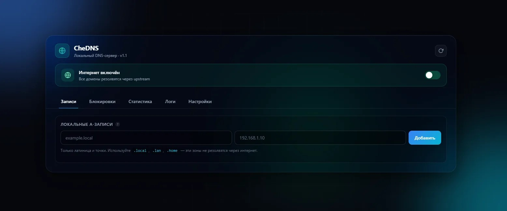
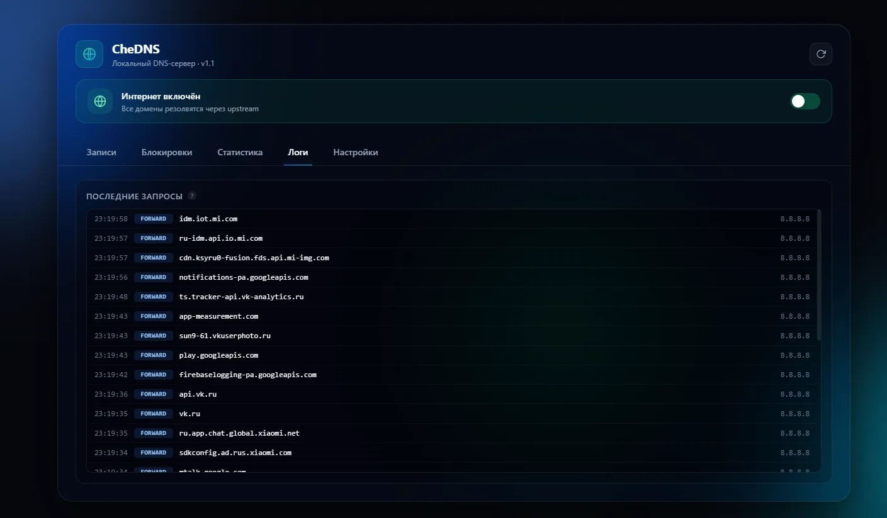
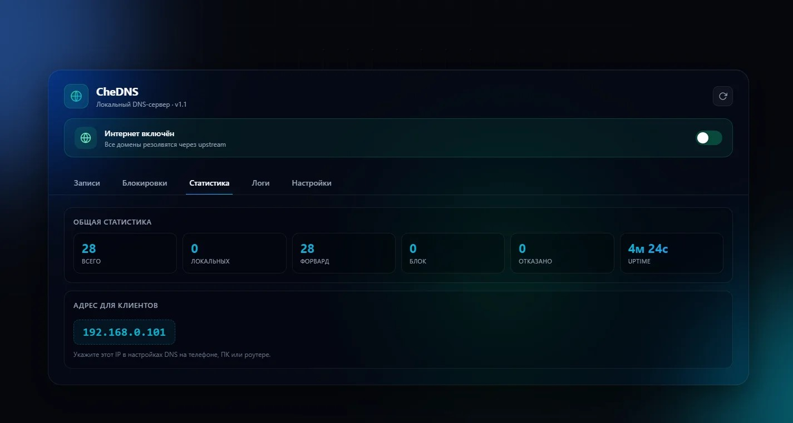

# 🌐 CheDNS

**Лёгкий DNS-сервер для Windows — в одном exe-файле.**

CheDNS — это локальный DNS-сервер, который превращает обычный компьютер с Windows в полноценный домашний/офисный DNS. Позволяет вести собственные DNS-записи, блокировать рекламу и трекеры, отключать доступ в интернет одной кнопкой и наблюдать за всей сетью через красивую веб-панель.

Работает как **портативное приложение** — без установки, без Python, без зависимостей. Запустил → работает.



---

## 📋 Содержание

- [Возможности](#-возможности)
- [Скриншоты](#-скриншоты)
- [Быстрый старт](#-быстрый-старт)
- [Как это работает](#-как-это-работает)
- [Веб-панель управления](#-веб-панель-управления)
- [Формат конфига](#-формат-конфига)
- [Требования](#-требования)
- [Сборка из исходников](#-сборка-из-исходников)
- [Известные ограничения](#-известные-ограничения)
- [Планы](#-планы)
- [Часто задаваемые вопросы](#-часто-задаваемые-вопросы)
- [Поддержать проект](#-поддержать-проект)
- [Лицензия](#-лицензия)
- [Автор](#-автор)

---

## ✨ Возможности

### 🌐 DNS-сервер

- **Полноценный DNS-сервер** на стандартном порту **53** (UDP)
- **Форвардинг на upstream DNS** — все внешние запросы уходят на 8.8.8.8, 1.1.1.1, 9.9.9.9 или любой другой указанный вручную
- **Поддержка типов запросов:** A, AAAA, CNAME, MX, TXT, NS, HTTPS, SVCB
- **PTR-запросы** обрабатываются корректно (возвращается NXDOMAIN, не засоряет логи)
- **TTL 60 секунд** для локальных записей (можно быстро менять без долгого кэша)
- **Многопоточная обработка** — держит десятки устройств одновременно

### 🛡️ Блокировка рекламы и трекеров

- **Чёрный список доменов** — добавляй вручную любые домены
- **Wildcard-блокировка** — блокировка `ads.example.com` автоматически блокирует `sub.ads.example.com`, `api.ads.example.com` и всё остальное
- **Мгновенное действие** — заблокированный домен сразу возвращает **NXDOMAIN**
- **Работает на всю локальную сеть** — все устройства, использующие CheDNS как DNS, получают блок
- **Одна кнопка** — добавил домен в панели, блокировка активна
- **Обход не работает** — меняешь DNS на 8.8.8.8 на клиенте, блокировка теряется (это ограничение любого DNS-фильтра)

### 📌 Локальные DNS-записи

- **Свои A-записи** — превращай любые имена в IP-адреса
- **Пример:** `myserver.local → 192.168.1.50`
- **Работают без интернета** — даже если отключить доступ, локальные имена резолвятся
- **Использование:** домашние сервисы, NAS, медиасервер, роутер, тестовые окружения
- **Рекомендуемые зоны:** `.local`, `.lan`, `.home`, `.internal` — эти TLD не резолвятся через интернет

### 🔌 Отключение интернета одной кнопкой

- **Toggle-переключатель** в веб-панели
- **ВКЛ:** все домены резолвятся через upstream (обычный интернет)
- **ВЫКЛ:** только локальные записи работают, всё остальное — NXDOMAIN
- **Режим «изолированная сеть»** — интернета нет, но твои сервисы работают
- **Полезно:** родительский контроль, режим «только работа», защита от отвлечений, кафе/мастерские

### 📊 Веб-панель управления

- **Порт 8080** — открывается в браузере по адресу `http://<IP>:8080`
- **Тёмный дизайн** со свечениями, плавными анимациями, стеклом
- **5 вкладок:** Записи, Блокировки, Статистика, Логи, Настройки
- **Живая статистика** — сколько запросов обработано, сколько заблокировано, uptime
- **Живые логи** — каждый DNS-запрос отображается в реальном времени
- **Цветные бейджи** — `LOCAL` (зелёный), `FORWARD` (голубой), `BLOCK` (красный), `DENY` (жёлтый)
- **Уведомления** — красивые тосты справа сверху при каждом действии
- **Подсказки** — значки `?` с пояснениями
- **Адаптивный дизайн** — работает на телефоне, планшете, ПК

### 🎨 Внешний вид

- **Тёмная тема** — не напрягает глаза
- **Фоновые свечения** — три анимированных orb'а (синий, циан, зелёный)
- **Сетка-оверлей** — тонкая, ненавязчивая
- **Стекло** — панель с эффектом «frosted glass» (blur 35px, прозрачность 15%)
- **Плавные анимации** — переходы между вкладками, появление блоков
- **Иконка** — своя для exe, своя для вкладки браузера

### 🚀 Портативность

- **Один exe-файл** ~13 МБ — всё внутри
- **Без установки** — просто скопировал и запустил
- **Без Python** — интерпретатор встроен
- **Без зависимостей** — Flask, dnslib, jinja2 уже внутри
- **Конфиг рядом** — `chedns_config.json` создаётся рядом с exe
- **Переносится на флешке** — можно носить и запускать на любом ПК

### 📝 Логи и мониторинг

- **Красивый вывод в консоль** — каждый запрос оформлен блоком:

```
─────────────────────────────────────────────────────
  [DNS запрос] [2026-09-12 22:20:01]

  Отправитель:  127.0.0.1:57830
  Тип:          udp
  Домен:        win1910.ipv6.microsoft.com (A)
  Обработка:    [FORWARD]  -> upstream 8.8.8.8
─────────────────────────────────────────────────────
```

- **Цветные логи** — ANSI-цвета для каждого типа события
- **История 200 запросов** в веб-панели
- **Счётчики** — всего, локальных, форвард, блок, отказано

---

## 📸 Скриншоты

### Главная панель


### Логи в консоли



### Статистика



---

## 🚀 Быстрый старт

### Шаг 1. Скачай exe

Перейди в раздел [**Releases**](../../releases) и скачай последний `CheDNS.exe`.

### Шаг 2. Запусти от администратора

- **Правой кнопкой** по `CheDNS.exe`
- **«Запуск от имени администратора»**
- Windows спросит разрешение (UAC) — нажми **«Да»**

⚠️ **Без прав администратора порт 53 не откроется.** Это системное ограничение Windows, не баг программы.

### Шаг 3. Разреши доступ в брандмауэре

При первом запуске Windows спросит:

> «Разрешить приложению CheDNS взаимодействовать с сетями?»

- ☑ **Частные сети** — обязательно
- ☐ Общедоступные сети — по желанию

Нажми **«Разрешить доступ»**.

### Шаг 4. Открой веб-панель

В браузере на этом же компьютере:

```
http://127.0.0.1:8080
```

или с другого устройства:

```
http://<IP-сервера>:8080
```

IP-сервера показан в консоли при запуске и в веб-панели (вкладка «Статистика»).

### Шаг 5. Настрой DNS на устройствах

- Открой настройки сети Wi-Fi / Ethernet на телефоне, ноутбуке, планшете
- Найди **DNS-сервер** (обычно «Настроить IP вручную»)
- Укажи IP-адрес сервера CheDNS (например, `192.168.0.101`)
- **Второй DNS оставь пустым** или укажи `8.8.8.8` (как fallback)
- Сохрани, переподключись к сети

### Шаг 6. Проверь работу

На другом устройстве открой командную строку:

```cmd
nslookup -type=A google.com. <IP-сервера>
```

Если вернуло IP — DNS работает. Если добавил локальную запись `test.local`:

```cmd
nslookup -type=A test.local. <IP-сервера>
```

Должно вернуть указанный IP.

---

## ⚙️ Как это работает

CheDNS слушает **два порта**:

- **UDP 53** — DNS-запросы от клиентов
- **TCP 8080** — веб-панель управления

### Логика обработки DNS-запросов

Каждый входящий запрос проходит **4 шага по приоритету:**

```
┌─────────────────────────────────────────────┐
│  1. Проверка блок-листа                     │
│     Если домен заблокирован → NXDOMAIN      │
└────────────────┬────────────────────────────┘
                 │ не заблокирован
                 ▼
┌─────────────────────────────────────────────┐
│  2. Проверка локальных записей              │
│     Если есть A-запись → возврат IP         │
└────────────────┬────────────────────────────┘
                 │ нет записи
                 ▼
┌─────────────────────────────────────────────┐
│  3. Форвардинг на upstream                  │
│     Если интернет ВКЛ → запрос на 8.8.8.8   │
└────────────────┬────────────────────────────┘
                 │ интернет ВЫКЛ
                 ▼
┌─────────────────────────────────────────────┐
│  4. Отказ                                   │
│     NXDOMAIN — домен не найден              │
└─────────────────────────────────────────────┘
```

### Примеры

| Домен | Блок-лист | Локальная запись | Интернет | Результат |
|---|---|---|---|---|
| `google.com` | — | — | ВКЛ | → форвард на 8.8.8.8 |
| `google.com` | — | — | ВЫКЛ | → NXDOMAIN |
| `ads.example.com` | ✅ | — | ВКЛ/ВЫКЛ | → NXDOMAIN (блок) |
| `test.local` | — | `192.168.1.50` | ВКЛ/ВЫКЛ | → 192.168.1.50 |
| `random.ru` | — | — | ВЫКЛ | → NXDOMAIN |

### Работа с клиентами

- **Клиент** (телефон, ПК) отправляет DNS-запрос на IP сервера CheDNS
- **CheDNS** обрабатывает и возвращает ответ
- **Клиент** использует полученный IP для соединения

Если клиент использует **другой DNS** — блокировки CheDNS не работают для него. Поэтому важно, чтобы клиент **точно использовал** IP сервера CheDNS.

---

## 🎛️ Веб-панель управления

### Вкладка «Записи»

- **Локальные A-записи** — домен + IP
- Добавление: введи домен, введи IP, нажми «Добавить»
- Удаление: крестик рядом с записью
- **Формат домена:** только латиница, цифры, дефис, точки
- **Примеры:** `test.local`, `my.server.lan`, `home.internal`

### Вкладка «Блокировки»

- **Заблокированные домены** — добавь домен, нажми «Заблокировать»
- Блокируется сам домен и **все поддомены** (wildcard)
- **Примеры для блокировки рекламы:**
  - `doubleclick.net`
  - `google-analytics.com`
  - `googlesyndication.com`
  - `ads.facebook.com`
  - `mc.yandex.ru`

### Вкладка «Статистика»

- **Всего запросов** — общее количество обработанных
- **Локальных** — сколько раз отдалась локальная запись
- **Форвард** — сколько раз ушли на upstream
- **Блок** — сколько раз сработал блок-лист
- **Отказано** — сколько раз NXDOMAIN по причине «интернет ВЫКЛ»
- **Uptime** — время работы сервера
- **Адрес для клиентов** — большой блок с IP-сервера

### Вкладка «Логи»

- **Последние 200 запросов** в реальном времени
- Обновление **каждые 2 секунды** автоматически
- Формат: `[время] [тип] [домен] [доп. инфо]`
- Цветные бейджи:
  - 🟢 `LOCAL` — локальная запись
  - 🔵 `FORWARD` — форвард на upstream
  - 🔴 `BLOCK` — заблокирован
  - 🟡 `DENY` — отказ (интернет выключен)

### Вкладка «Настройки»

- **Апстрим DNS** — IP-адрес внешнего DNS-сервера
  - `8.8.8.8` — Google
  - `1.1.1.1` — Cloudflare
  - `9.9.9.9` — Quad9
  - `77.88.8.8` — Яндекс
- **Информация о сервере** — версия, IP, порты

### Кнопки в шапке

- **Обновить** (иконка круговой стрелки) — принудительно перезагрузить конфиг
- **Переключатель интернета** — toggle в статус-баннере

### Уведомления

Все действия показывают **тост справа сверху:**

- 🟢 **Зелёный** — успех
- 🔴 **Красный** — ошибка
- 🔵 **Синий** — информация
- 🟡 **Жёлтый** — предупреждение

Тост исчезает через 3.5 секунды автоматически.

---

## 📁 Формат конфига

Конфиг хранится в файле `chedns_config.json` **рядом с exe** (или рядом с `chedns.py` при запуске из исходников).

### Структура

```json
{
  "records": {
    "test.local": "192.168.0.101",
    "router.lan": "192.168.0.1",
    "nas.home": "192.168.0.50"
  },
  "blocked": [
    "doubleclick.net",
    "google-analytics.com",
    "ads.facebook.com"
  ],
  "internet_enabled": true,
  "upstream_dns": "8.8.8.8",
  "listen_ip": "0.0.0.0",
  "dns_port": 53,
  "web_port": 8080
}
```

### Поля

| Поле | Тип | Описание |
|---|---|---|
| `records` | объект | Локальные A-записи: `домен → IP` |
| `blocked` | массив | Заблокированные домены |
| `internet_enabled` | bool | Включён ли форвардинг на upstream |
| `upstream_dns` | строка | IP внешнего DNS-сервера |
| `listen_ip` | строка | На каком интерфейсе слушать DNS (0.0.0.0 = все) |
| `dns_port` | число | Порт DNS (по умолчанию 53) |
| `web_port` | число | Порт веб-панели (по умолчанию 8080) |

### Ручное редактирование

Можно править файл напрямую — при следующем запуске изменения подхватятся. Например, чтобы разом добавить 50 блокировок, проще открыть JSON и вписать массивом, чем кликать в панели.

⚠️ **Перед редактированием закрой сервер** — иначе при сохранении конфига из панели твои правки перезапишутся.

---

## 💻 Требования

### Для запуска exe

- **ОС:** Windows 10 или Windows 11 (**только x64**)
- **Процессор:** любой x86-64
- **ОЗУ:** 100 МБ свободно (реально нужно ~40 МБ)
- **Диск:** ~15 МБ для exe + ~5 МБ под конфиг и кэш
- **Права:** **администратор** (для порта 53)
- **Свободный порт:** 53/UDP (иногда занят службой ICS)
- **Firewall:** разрешение на входящие

### Что НЕ поддерживается

- ❌ Windows 7 / 8 / 8.1
- ❌ Windows на ARM (Surface Pro X и т.п.)
- ❌ 32-битные системы
- ❌ Linux / macOS (только через Python из исходников)

---

## 🛠️ Сборка из исходников

### Требования

- **Python 3.10+** (проверялось на 3.14)
- **pip**
- **Windows x64**

### Шаги

1. **Клонируй репозиторий:**

```bash
git clone https://github.com/CheDev-official/CheDNS.git
cd CheDNS
```

2. **Установи зависимости:**

```bash
pip install -r requirements.txt
```

3. **Запусти сервер напрямую:**

```bash
python chedns.py
```

4. **Или собери exe:**

```bash
build.bat
```

Готовый файл появится в `dist\CheDNS.exe`.

### requirements.txt

```
dnslib==0.9.26
flask==3.1.3
pyinstaller>=6.15
```

### Что внутри `build.bat`

- Проверяет наличие Python
- Устанавливает зависимости
- Очищает старые сборки
- Запускает PyInstaller с конфигом `che_dns.spec`
- Встраивает иконку `icon.ico`
- Кладёт результат в `dist\CheDNS.exe`

---

## ⚠️ Известные ограничения

- **Только Windows x64** — ARM и 32-bit не поддерживаются
- **Нет поддержки DoH/DoT** — только обычный plain DNS на порту 53
- **Нет авторизации** в веб-панели — любой в локальной сети может открыть `http://<IP>:8080` и увидеть всё
- **Нет HTTPS** для веб-панели
- **Нет wildcard-записей** — только точечные `domain.tld → IP`
- **Нет AAAA/CNAME/MX** для локальных записей — только A (IPv4)
- **Обходится сменой DNS** на клиенте — если клиент использует 8.8.8.8 напрямую, блокировки и записи CheDNS не действуют
- **DoH в браузере обходит CheDNS** — если в Chrome/Firefox включён «Безопасный DNS», запросы идут мимо
- **Порт 53 может быть занят** — службой ICS, Windows DNS Client, другим DNS-сервером
- **Порт 80** — если хочешь веб-панель без `:8080`, надо менять в конфиге (порт 80 часто занят)
- **Только plain DNS** — нет шифрования

---

## 🗺️ Планы

- [ ] **Авторизация в веб-панели** (логин + пароль)
- [ ] **HTTPS** для веб-панели (самоподписанный сертификат)
- [ ] **DoH** (DNS-over-HTTPS) — принимать зашифрованные запросы
- [ ] **DoT** (DNS-over-TLS) — на порту 853
- [ ] **Wildcard-записи** — `*.local → 192.168.0.101`
- [ ] **AAAA-записи** — IPv6
- [ ] **CNAME-записи** — алиасы
- [ ] **Готовые блок-листы** — загрузка AdBlock-совместимых списков в один клик
- [ ] **Автообновление блок-листов** — раз в сутки
- [ ] **Экспорт/импорт конфига** — кнопки в UI
- [ ] **Автозапуск Windows** — ярлык в `shell:startup`
- [ ] **Установка как службы Windows** — через NSSM
- [ ] **Тихий режим** — без чёрного окна консоли
- [ ] **Светлая тема** — переключатель
- [ ] **Разные правила для разных клиентов** — по IP/MAC
- [ ] **API** для внешних интеграций
- [ ] **Поддержка Linux/macOS** — через Docker
- [ ] **Логи в файл** с ротацией
- [ ] **Уведомления в UI** о новых версиях

---

## ❓ Часто задаваемые вопросы

### Порт 53 занят, что делать?

Скорее всего, служба **Internet Connection Sharing (ICS)** или **Windows DNS Client** держат порт. Открой `cmd` **от администратора** и выполни:

```cmd
net stop "Internet Connection Sharing (ICS)"
```

Или измени порт в `chedns_config.json` на `5353` (но тогда клиенты не смогут использовать сервер как DNS — порт 53 обязателен).

### Клиент не использует CheDNS

Проверь на клиенте:

1. В настройках сети **DNS указан правильно** (IP сервера CheDNS)
2. **Второй DNS пустой** — если там `8.8.8.8`, Windows может использовать его вместо твоего
3. **IPv6 DNS** — тоже проверь, часто там провайдерский
4. **DoH в браузере** — отключи «Безопасный DNS» в настройках Chrome/Edge/Firefox
5. **DoH в системе** — Windows 11 может использовать шифрованный DNS
6. `ipconfig /flushdns` — сбрось кэш DNS

### Браузер не открывает заблокированный сайт

Если `nslookup` возвращает NXDOMAIN, а браузер всё равно открывает:

1. **DoH в браузере** — отключи
2. **DNS-кэш браузера** — открой в инкогнито
3. **Соединение уже установлено** — закрой вкладку, открой заново

### Локальные записи не работают в браузере

Браузер может использовать **DoH**, игнорируя системный DNS. Отключи в настройках браузера.

### Как добавить блокировку рекламы?

Добавь в раздел «Блокировки» основные домены:

```
doubleclick.net
google-analytics.com
googlesyndication.com
googleadservices.com
ads.facebook.com
ads.yahoo.com
mc.yandex.ru
```

Сайты станут загружаться быстрее.

### Можно ли использовать CheDNS на роутере?

Нет. CheDNS — это **программа для Windows**, а не прошивка для роутера. Но ты можешь:

- Поставить CheDNS на отдельный Windows-ПК в сети
- Прописать его IP как DNS в настройках роутера (DHCP)
- Тогда все устройства в сети будут автоматически использовать CheDNS

### Что произойдёт, если сервер упадёт?

Клиенты не смогут резолвить домены, пока сервер не поднимется. **Решается вторым DNS** в настройках клиента — например, `8.8.8.8` как fallback. Правда, в этом случае блокировки перестанут работать.

### Как перенести конфиг на другой ПК?

Скопируй `chedns_config.json` рядом с exe на новом ПК. Все записи и блокировки перенесутся.

---

## 💖 Поддержать проект

CheDNS полностью **бесплатный и открытый**. Если он оказался полезен — можешь поддержать разработку:

- 💳 **ЮMoney:** [yoomoney.ru/to/4100119456322037](https://yoomoney.ru/to/4100119456322037)

Буду рад каждому донату — это мотивирует развивать проект дальше. ❤️

**Другие способы помочь (бесплатно):**

- ⭐ Поставь **звезду** репозиторию
- 🐛 Сообщи о **баге** в [Issues](../../issues)
- 💡 Предложи **идею** в Discussions
- 📢 Расскажи о проекте друзьям
- 🔀 Сделай **форк** и улучши код

---

## 📜 Лицензия

Распространяется под лицензией **MIT**. Используй, форкай, модифицируй, продавай — как угодно.

См. файл [LICENSE](LICENSE) для полного текста.

---

## 👤 Автор

**Che1lVK / CheDev-official**

- 🐙 GitHub: [@CheDev-official](https://github.com/CheDev-official)
- 🌐 Сайт: [чеил.рф](https://чеил.рф)
- 🎥 VK Video: [vkvideo.ru/@che1lvk](https://vkvideo.ru/@che1lvk)

---

## 💬 Честно о разработке

Честно скажу: я написал данное ПО при помощи ИИ, но редактировал и исправлял ошибки лично я.

Если считаешь такой подход неприемлемым — это твоё право, проект открытый, ты можешь использовать его как есть или переписать полностью. Часть кода написана ИИ, а доведена до рабочего состояния мной лично. буду рад, если CheDNS окажется полезным.

---

⭐ **Если проект понравился — поставь звёздочку!** Это поможет другим людям его найти.
